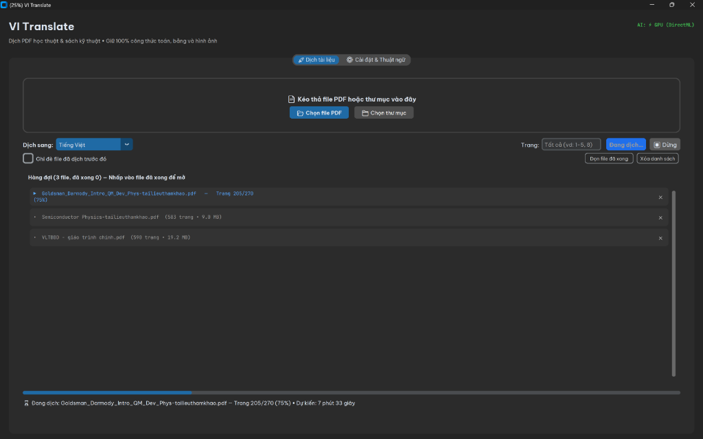
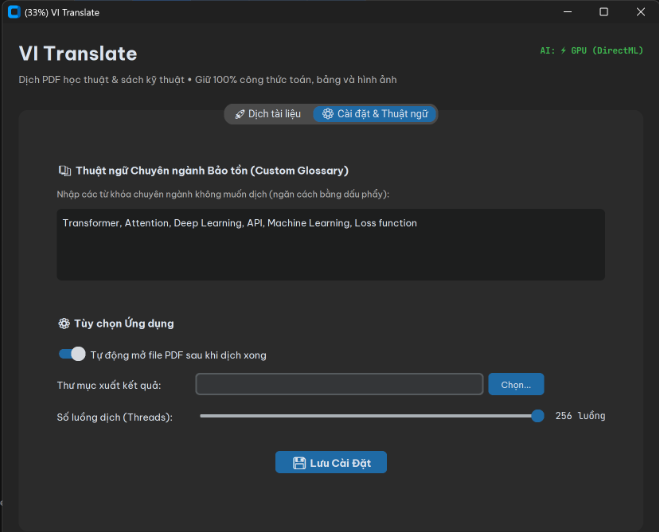
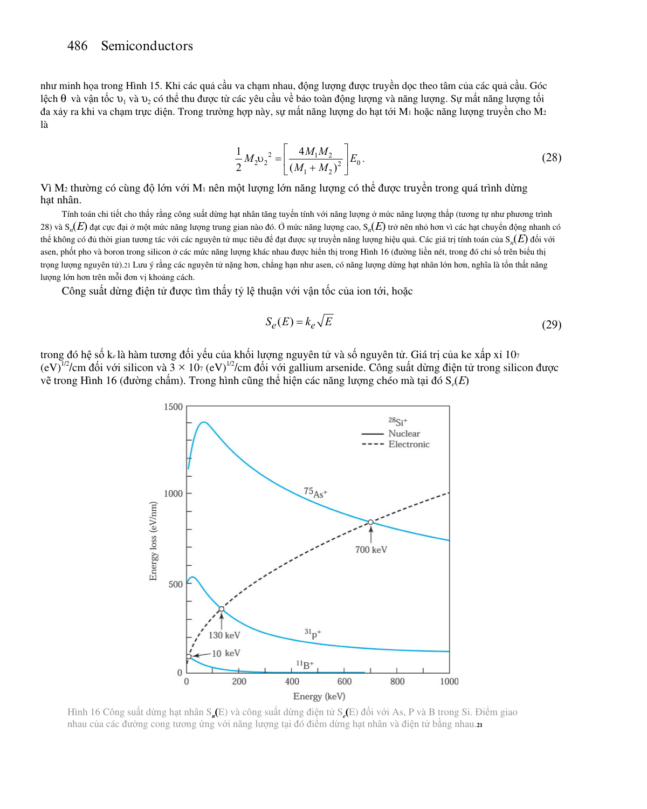

# VI-Translate (PDF Academic Translation Tool)

<p align="center">
  <b>Dịch tài liệu PDF khoa học, giáo trình kỹ thuật sang tiếng Việt — Giữ nguyên 100% bố cục, bảng biểu và công thức toán học.</b>
</p>

<p align="center">
  
  
  
  
  
  
</p>

---

## 📌 Mục lục

- [📸 Giao diện Ứng dụng & Kết quả Thực tế](#-giao-diện-ứng-dụng--kết-quả-thực-tế)
- [🚀 Điểm nổi bật phiên bản 2.0.0](#-điểm-nổi-bật-phiên-bản-200)
- [📥 Tải về & Cài đặt](#-tải-về--cài-đặt)
  - [1. Bản Windows App đóng gói sẵn (.exe)](#1-bản-windows-app-đóng-gói-sẵn-khuyên-dùng-cho-người-dùng-phổ-thông)
  - [2. Chạy trên Google Colab](#2-chạy-trên-google-colab-siêu-tốc-với-mạng-gigabit)
  - [3. Chạy từ mã nguồn Python](#3-chạy-từ-mã-nguồn-python-dành-cho-lập-trình-viên)
- [📖 Hướng dẫn sử dụng](#-hướng-dẫn-sử-dụng)
  - [Giao diện Đồ họa Desktop (GUI)](#1-sử-dụng-giao-diện-desktop-gui)
  - [Giao diện Dòng lệnh (CLI)](#2-sử-dụng-dòng-lệnh-cli)
  - [Bảo tồn Thuật ngữ Chuyên ngành (Custom Glossary)](#3-bảo-tồn-thuật-ngữ-chuyên-ngành-custom-glossary)
- [🔬 So sánh Tính năng](#-so-sánh-tính-năng)
- [🛠️ Đóng gói Ứng dụng Windows (.exe)](#️-đóng-gói-ứng-dụng-windows-exe)
- [📋 Kiểm thử Tự động (Unit Tests)](#-kiểm-thử-tự-động-unit-tests)
- [❓ Câu hỏi thường gặp (FAQ)](#-câu-hỏi-thường-gặp-faq)
- [📜 Giấy phép & Ghi công](#-giấy-phép--ghi-công)

---

## 📸 Giao diện Ứng dụng & Kết quả Thực tế

### 1. Giao diện Dịch thuật Kéo thả & Tiến độ Thời gian thực
Giao diện trực quan, hỗ trợ kéo thả nhiều file/thư mục đồng thời, theo dõi phần trăm hoàn thành theo từng trang và ước tính chính xác thời gian còn lại (ETA):

<p align="center">
  
</p>

### 2. Tab Cài đặt & Thuật ngữ Chuyên ngành Bảo tồn (Custom Glossary)
Dễ dàng thiết lập các từ khóa/thuật ngữ kỹ thuật không muốn dịch, điều chỉnh số luồng song song lên tới **256 luồng**, tự động phát hiện và kích hoạt tăng tốc phần cứng GPU (DirectML):

<p align="center">
  
</p>

### 3. Kết quả Dịch Thực tế (Bảo toàn 100% Công thức Toán học & Biểu đồ)
Minh chứng thực tế dịch trang giáo trình kỹ thuật bán dẫn (*Semiconductors*): bảo toàn nguyên vẹn phân số, ma trận, căn bậc hai $\sqrt{E}$, chỉ số trên/dưới, đồ thị và căn lề văn bản chuẩn xuất bản:

<p align="center">
  
</p>

---

## 🚀 Điểm nổi bật phiên bản 2.0.0

- 📐 **Bảo toàn công thức toán học đỉnh cao (Formula Preservation Engine):**
  - Bảo toàn 100% các khối công thức độc lập (Display Formulas): phân số nhiều tầng, ma trận, tích phân, căn bậc hai $\sqrt{E}$, số mũ và chỉ số dưới.
  - Bảo tồn ký tự Hy Lạp ($\lambda, \mu, \Delta, \xi, \dots$) và biến số có dấu phụ ($\bar{n}_1, d\bar{n}_1/d\lambda$).
  - Ngăn ngừa hoàn toàn hiện tượng nhảy chữ, rớt dấu ngoặc hoặc xáo trộn ký tự toán học vào văn bản.

- 🔤 **Công nghệ ghép chữ thông minh (Smart Forward/Backward Stitching):**
  - Tự động phát hiện và ghép nối liền mạch chữ cái đầu dòng (`Since` $\to$ dịch chuẩn: **`Vì`**, `where` $\to$ dịch chuẩn: **`trong đó`**), loại bỏ hoàn toàn các lỗi rách từ như `Svì`, `wở đây`.
  - Tự động hàn gắn các dòng câu dài bị đứt đoạn giữa chừng trước khi gửi dịch, giúp bản dịch tự nhiên, chuẩn văn phong tiếng Việt học thuật.

- 📏 **Kiểm soát cỡ chữ đồng đều & Chống teo nhỏ (Font Sizing Floor):**
  - Áp dụng sàn tỷ lệ font tối thiểu thông minh (78–80%), kết hợp thu gọn khoảng cách dòng (`line_height` floor 0.75) thay vì co nhỏ kích thước chữ. Toàn trang hiển thị rõ ràng (8.0–10pt), chuẩn xuất bản.

- ⚡ **Tốc độ siêu tốc (Mở khóa tới 256 luồng):**
  - Tối ưu hóa HTTP Connection Pool (`urllib3/requests`) với `pool_maxsize=256` và cơ chế retry thông minh với exponential backoff.
  - Xử lý đồng thời hàng trăm trang giáo trình trong vài chục giây.

- 🎯 **Trí tuệ nhân tạo nhận diện bố cục (`DocLayout-YOLO`):**
  - Tự động phát hiện và phân vùng chính xác văn bản, hình vẽ, bảng biểu, chú thích hình (Captions) và mục lục (TOC).
  - Tự động nhận diện GPU (DirectML) để tăng tốc độ phân tích layout tài liệu trên máy tính cá nhân.

---

## 📥 Tải về & Cài đặt

### 1. Bản Windows App đóng gói sẵn (Khuyên dùng cho người dùng phổ thông)
1. Tải bản mới nhất tại [Releases](https://github.com/DATWY/PDF-Translate-VI/releases/latest) (Tải file `PDFTranslate-windows.zip`).
2. Giải nén thư mục và nhấp đúp vào `PDFTranslate.exe` để sử dụng ngay.
3. *Không cần cài đặt Python, không cần cài thư viện.*

---

### 2. Chạy trên Google Colab (Siêu tốc với mạng Gigabit)

Chỉ cần mở một Google Colab Notebook và chạy các lệnh sau:

```python
# 1. Tải mã nguồn & cài đặt thư viện
!git clone https://github.com/DATWY/PDF-Translate-VI.git /content/PDF-Translate-VI
%cd /content/PDF-Translate-VI
!pip install -q -r requirements.txt
!python scripts/fetch_assets.py

# 2. Dịch PDF với 64 luồng song song
!python -m pdf2zh.pdf2zh "duong_dan_file.pdf" -li en -lo vi -t 64 -o "output"
```

---

### 3. Chạy từ mã nguồn Python (Dành cho lập trình viên)

```bash
# 1. Clone repository
git clone https://github.com/DATWY/PDF-Translate-VI.git
cd PDF-Translate-VI

# 2. Khởi tạo môi trường ảo Python 3.10+
python -m venv .venv
# Trên Windows:
.venv\Scripts\activate
# Trên Linux/macOS:
source .venv/bin/activate

# 3. Cài đặt dependencies và tải assets model
pip install -r requirements.txt
python scripts/fetch_assets.py

# 4. Khởi chạy giao diện Desktop GUI
python -m app.gui
```

---

## 📖 Hướng dẫn sử dụng

### 1. Sử dụng Giao diện Desktop (GUI)
1. **Kéo thả** một hoặc nhiều file PDF (hoặc cả thư mục) vào vùng kéo thả.
2. Chọn **Ngôn ngữ nguồn** (`en - English`) và **Ngôn ngữ đích** (`vi - Tiếng Việt`).
3. Chọn **Dải trang** cần dịch (để trống nếu muốn dịch toàn bộ, hoặc nhập ví dụ `1-50, 75, 100-120`).
4. Bấm nút **Bắt đầu dịch**. Kết quả song ngữ / đơn ngữ được tạo tự động cùng thư mục với file gốc.

### 2. Sử dụng Dòng lệnh (CLI)
```bash
# Dịch toàn bộ tài liệu với 64 luồng:
python scripts/translate_pdf.py input.pdf --output-dir output --threads 64

# Dịch dải trang cụ thể (từ trang 1 đến 50):
python scripts/translate_pdf.py input.pdf --output-dir output --pages 1-50 --threads 64

# Sử dụng engine dịch thuật tùy chọn (google, handoff):
python scripts/translate_pdf.py input.pdf --output-dir output --engine google
```

### 3. Bảo tồn Thuật ngữ Chuyên ngành (Custom Glossary)
Tại tab **Cài đặt & Thuật ngữ**, bạn có thể nhập các thuật ngữ chuyên ngành công nghệ hoặc y khoa (ngăn cách bằng dấu phẩy) như:
```text
Transformer, Attention, Deep Learning, API, Machine Learning, Loss function, Dropout, Backpropagation
```
Ứng dụng sẽ tự động bảo vệ các từ này, giữ nguyên gốc tiếng Anh trong toàn bộ bản dịch tiếng Việt.

---

## 🔬 So sánh Tính năng

| Tính năng | VI-Translate 2.0 | Google Dịch PDF mặc định | Các tool dịch PDF thông thường |
| :--- | :---: | :---: | :---: |
| **Bảo toàn công thức toán (LaTeX/MathML)** | ✅ **100% Hoàn hảo** | ❌ Bị mất hoặc dịch sai nghĩa | ⚠️ Dễ vỡ layout, rớt ký tự |
| **Bảo tồn bảng biểu & đồ thị** | ✅ **Giữ nguyên gốc** | ❌ Vỡ khung bảng | ⚠️ Lệch cột |
| **Tốc độ dịch đa luồng** | ⚡ **Lên tới 256 luồng** | ❌ Rất chậm (từng trang) | ⚠️ 4 - 8 luồng |
| **Xử lý ghép chữ & nối câu** | ✅ **Smart NLP Stitching** | ❌ Ngắt câu cụt lủn | ❌ Chữ cái đầu dòng bị nhảy |
| **Chống teo nhỏ font chữ** | ✅ **Font Sizing Floor** | ❌ Chữ bị đè lên nhau | ❌ Font teo nhỏ không đọc được |
| **Thuật ngữ chuyên ngành tùy chỉnh** | ✅ **Có sẵn (Glossary)** | ❌ Không hỗ trợ | ❌ Không hỗ trợ |
| **Hoạt động Offline (Standalone .exe)** | ✅ **Chạy ngay không cần cài Python** | ❌ Chỉ có Web | ⚠️ Yêu cầu cài Python phức tạp |

---

## 🛠️ Đóng gói Ứng dụng Windows (.exe)

Nếu bạn sửa đổi mã nguồn và muốn đóng gói lại thành file `.exe` độc lập cho người dùng khác:

```powershell
# Chạy script đóng gói tự động trên PowerShell:
powershell -ExecutionPolicy Bypass -File build.ps1
```
*Kết quả đóng gói sẽ nằm trong thư mục `dist_v19/` kèm file nén `PDFTranslate-windows.zip`.*

---

## 📋 Kiểm thử Tự động (Unit Tests)

Dự án tích hợp bộ **84 bài kiểm thử tự động (100% Pass)** bao quát toàn bộ tính năng xử lý công thức toán, font chữ, độ phân giải bảng biểu, xử lý TOC, URLs và kiểm soát luồng:

```bash
python -m unittest discover tests
```

---

## ❓ Câu hỏi thường gặp (FAQ)

<details>
<summary><b>1. File PDF dạng ảnh scan có dịch được không?</b></summary>
Hệ thống hiện tại tối ưu hóa cho các tài liệu PDF vector/digital (có thể bôi đen chữ). Nếu tài liệu là ảnh scan thuần túy 100%, hệ thống sẽ giữ nguyên trang và thông báo cần OCR trước khi dịch.
</details>

<details>
<summary><b>2. File kết quả sau khi dịch được lưu ở đâu?</b></summary>
Mặc định, file dịch sẽ được lưu cùng thư mục với file PDF gốc (hoặc thư mục xuất bạn chọn trong tab Cài đặt), với hậu tố <code>-mono.pdf</code> (chỉ tiếng Việt) và <code>-dual.pdf</code> (song ngữ song song).
</details>

<details>
<summary><b>3. Làm sao để dịch nhanh nhất các sách dày hàng trăm trang?</b></summary>
Bạn có thể tăng số luồng lên <b>64 - 128 luồng</b> trên mạng gia đình, hoặc chạy trực tiếp trên <b>Google Colab</b> với tốc độ mạng Gigabit để hoàn thành một quyển sách 500 trang chỉ trong vài phút.
</details>

---

## 📜 Giấy phép & Ghi công

Dự án được phân phối theo giấy phép [AGPL-3.0](LICENSE).  
Phát triển và nâng cấp dựa trên nền tảng [PDFMathTranslate](https://github.com/Byaidu/PDFMathTranslate) & [BabelDOC](https://github.com/funstory-ai/BabelDOC). Xem chi tiết tại [THIRD_PARTY_NOTICES.md](THIRD_PARTY_NOTICES.md).
